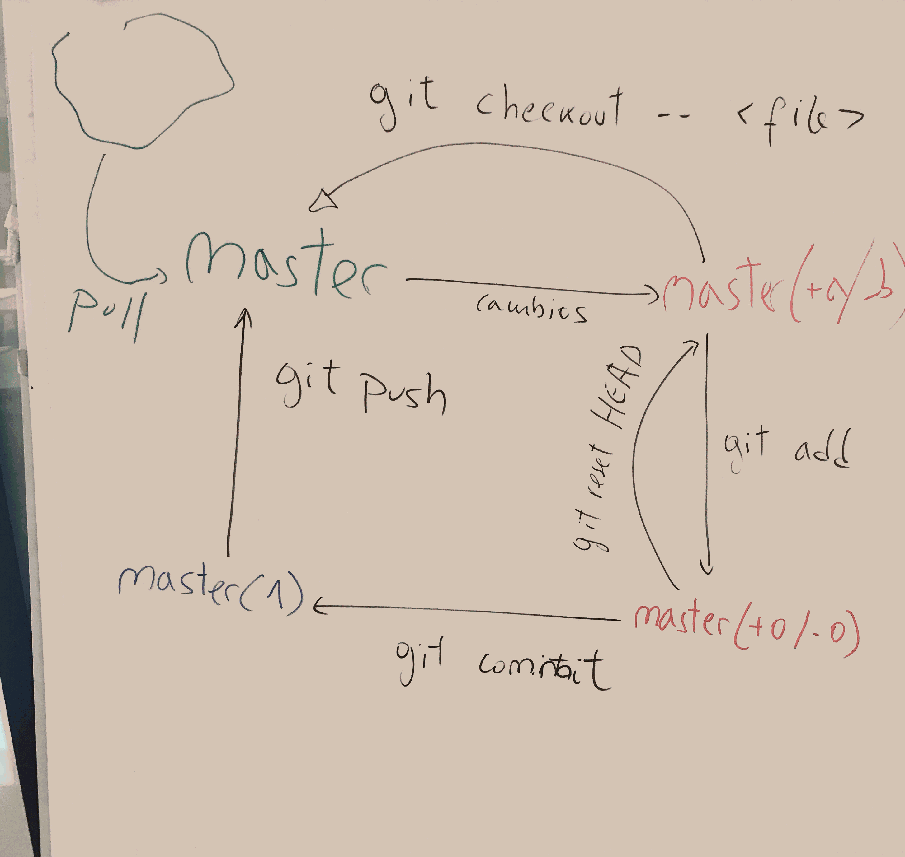

# Linea de Comandos

Aquí dejo algunos de los comandos que hemos aprendido.

	+ ls --> lista los ficheros y directorios de una ruta, si no le indicamos ruta se realiza sobre la carpeta en la que nos encontramos.
	+ cat --> muestra por pantalla el contenido de un fichero.
	+ cp <origen> <destino> --> copia un fichero de la ruta de origen a la ruta de destino.
	+ mv <origen> <destino> --> mueve un fichero de la ruta de origen a la ruta de destino.
	+ rm <fichero> --> elimina el fichero en cuestión.
	+ mkdir <nombre> --> crea un directorio con el nombre indicado.
	+ cd <directorio> --> cambia nuestro directorio actual por el que indicamos.
	+ chmod <permisos> <fichero> --> cambia los permisos sobre un fichero.
	+ touch <fichero> --> crea un fichero.
	+ wc --> cuenta las palabras, lineas y byte de un fichero.
	+ head <fichero> --> Muestra las primeras lineas de un fichero.
	+ tail <fichero> --> Muestra las últimas lineas de un fichero.
	+ find --> Busca un fichero por nombre y/o tipo fichero y/o tamaño y/o última modificación, etc.
	+ | --> el uso del pipe nos sirve para encadenar distintos comandos.

Como resumen de git hemos visto:

